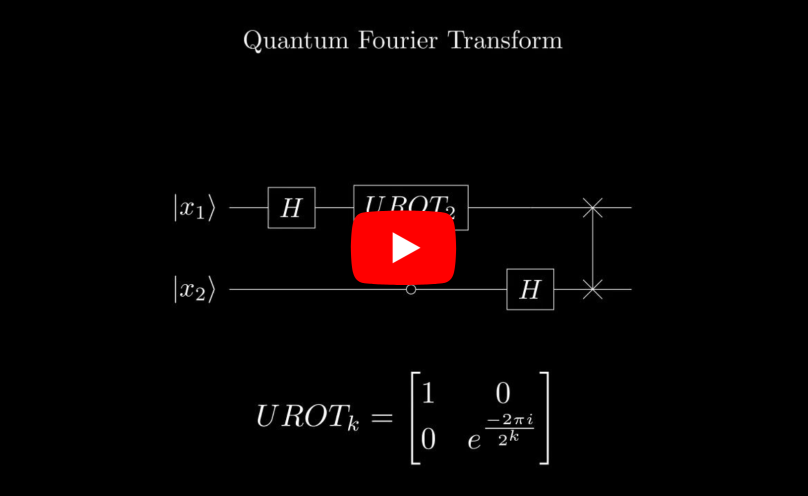

# Quantum Fourier Transform explained

Source code for the YouTube video [Quantum Fourier Transform explained](https://youtu.be/BaQNIcw1hn4).

- Animations made using [Manim](https://www.manim.community/)
- Voiceover added with [Manim Voicover](https://voiceover.manim.community/en/stable/) and synchronized by [OpenAI Whisper](https://openai.com/research/whisper)
- Speech synthetised with [Azure Text to Speech](https://azure.microsoft.com/en-us/products/cognitive-services/text-to-speech)
- Inspired by [Qiskit Textbook](https://learn.qiskit.org/course/ch-algorithms/quantum-fourier-transform) and [3Blue1Brown's video](https://www.youtube.com/watch?v=spUNpyF58BY)